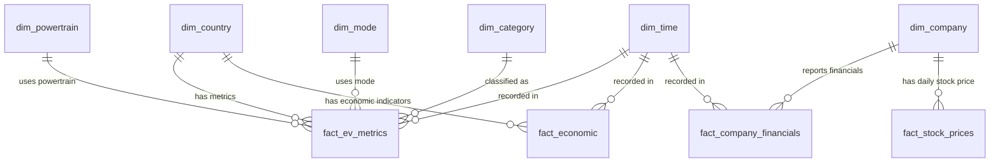

# EV Intelligence Platform - Data Warehouse & ETL Documentation

This documentation describes the Data Warehouse design and ETL pipeline setup to consolidate the scattered EV market datasets (EV sales/stock, GDP, Population, Access to electricity, crude oil prices, stock prices, and company financials) into a single, clean database.

---

## 1. Database Schema (Star Schema)

The database, named `ev_intelligence_dw`, is designed as a **Star Schema** to optimize reporting and visualization performance in tools like Power BI.

### Schema Diagram



### Table Definitions

#### Dimension Tables
1. **`dim_country`**: Stores countries and region aggregates (e.g., World, USA, China).
   - Columns: `country_id` (PK), `country_name` (Unique)
2. **`dim_time`**: Stores standard calendar years.
   - Columns: `time_id` (PK), `year` (Unique), `quarter`, `month`
3. **`dim_company`**: Stores EV and automotive manufacturers.
   - Columns: `company_id` (PK), `company_name`, `ticker` (Unique)
4. **`dim_powertrain`**: Stores engine and powertrain configurations (e.g., BEV, PHEV, FCEV).
   - Columns: `powertrain_id` (PK), `powertrain` (Unique)
5. **`dim_mode`**: Stores vehicle categories (e.g., Cars, Buses, Vans, Trucks, 2 and 3 wheelers).
   - Columns: `mode_id` (PK), `mode` (Unique)
6. **`dim_category`**: Stores categories of records (e.g., Historical, Projection-STEPS).
   - Columns: `category_id` (PK), `category` (Unique)

#### Fact Tables
1. **`fact_ev_metrics`**: Stores EV sales volume and EV stock counts.
   - Columns: `ev_id` (PK), `country_id` (FK), `time_id` (FK), `powertrain_id` (FK), `mode_id` (FK), `category_id` (FK), `parameter`, `value`, `unit`
2. **`fact_economic`**: Stores country-level macroeconomic metrics.
   - Columns: `economic_id` (PK), `country_id` (FK), `time_id` (FK), `gdp`, `population`, `access_to_electricity`, `crude_oil_price`
3. **`fact_company_financials`**: Stores annual manufacturer financial statements.
   - Columns: `financial_id` (PK), `company_id` (FK), `time_id` (FK), `revenue`, `gross_profit`, `operating_income`, `net_income`, `ebitda`, `basic_eps`, `diluted_eps`
4. **`fact_stock_prices`**: Stores daily stock market prices for listed companies.
   - Columns: `stock_id` (PK), `company_id` (FK), `date`, `open`, `high`, `low`, `close`, `adj_close`, `volume`

---

## 2. Setup Instructions

### Prerequisites
1. **MySQL Server**: Ensure MySQL server is installed and running locally.
2. **Python Dependencies**: Install python packages if not already installed:
   ```bash
   pip install pandas mysql-connector-python openpyxl xlrd
   ```

### Execution Steps
To create the database, build tables, and run the complete end-to-end data loading pipeline:

1. **Verify Database Credentials**:
   Open [etl_pipeline.py](file:///c:/Users/Bala%20murukan/Downloads/New%20folder/EV_Intelligencee_platform/03_Scripts/etl/etl_pipeline.py) and check that the MySQL config matches your environment:
   ```python
   DB_HOST = "localhost"
   DB_USER = "root"
   DB_PASS = "1979"
   ```
2. **Run the ETL Script**:
   Execute the pipeline in your terminal:
   ```bash
   python "03_Scripts/etl/etl_pipeline.py"
   ```
   The script will:
   - Read schema definitions from [schema.sql](file:///c:/Users/Bala%20murukan/Downloads/New%20folder/EV_Intelligencee_platform/04_SQL/schema.sql).
   - Recreate the `ev_intelligence_dw` database and its tables.
   - Read and process all cleaned data files in `02_Cleaned_Data/`.
   - Batch insert the data into the tables.
   - Print a verification table count summary upon completion.

---

## 3. Analysis Query Examples

Once data is loaded, you can run multi-source analysis queries that were previously difficult.

### Example: Compare EV Sales with GDP and Population (2023)
```sql
SELECT 
    c.country_name,
    t.year,
    SUM(ev.value) AS total_ev_sales,
    eco.gdp,
    eco.population
FROM fact_ev_metrics ev
JOIN dim_country c ON ev.country_id = c.country_id
JOIN dim_time t ON ev.time_id = t.time_id
JOIN fact_economic eco ON eco.country_id = c.country_id AND eco.time_id = t.time_id
WHERE ev.parameter = 'EV sales' 
  AND t.year = 2023
GROUP BY c.country_name, t.year, eco.gdp, eco.population
ORDER BY total_ev_sales DESC;
```
