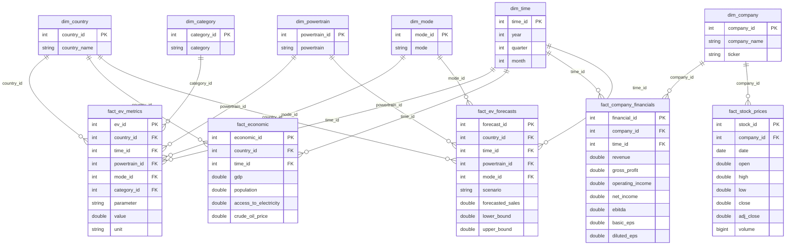

# EV Intelligence Platform - Data Warehouse Star Schema Architecture

## 1. Overview & Conceptual Architecture
The **EV Intelligence Data Warehouse** (`ev_intelligence_dw.sqlite`) is designed using a **Star Schema** dimensional modeling methodology. It centralizes 84,000+ data records covering global Electric Vehicle (EV) sales, country macroeconomics, company income statements, daily stock prices, and AI predictive forecasts across 221 countries/regions and 26 years (2005–2030).

---

## 2. Table Specifications

### Dimension Tables (`dim_*`)
| Table Name | Description | Key Column (PK) | Additional Attributes | Total Records |
| :--- | :--- | :--- | :--- | :--- |
| **`dim_country`** | Global countries & regions | `country_id` | `country_name` | 221 |
| **`dim_time`** | Master time dimension | `time_id` | `year`, `quarter`, `month` | 26 (2005-2030) |
| **`dim_company`** | Automotive OEMs & EV manufacturers | `company_id` | `company_name`, `ticker` | 34 |
| **`dim_powertrain`** | EV technology types | `powertrain_id` | `powertrain` (BEV, PHEV, FCEV) | 3 |
| **`dim_mode`** | Transport mode classifications | `mode_id` | `mode` (Cars, Vans, Buses, 2/3W, Trucks) | 5 |
| **`dim_category`** | Data domain categories | `category_id` | `category` (Historical, Projection) | 2 |

### Fact Tables (`fact_*`)
| Table Name | Grain / Entity | Foreign Keys (FK) | Core Measures | Total Rows |
| :--- | :--- | :--- | :--- | :--- |
| **`fact_ev_metrics`** | Annual EV sales & stock per country | `country_id`, `time_id`, `powertrain_id`, `mode_id`, `category_id` | `value` (Sales / Stock volume), `unit` | ~12,500 |
| **`fact_economic`** | Macroeconomic indicators per country/year | `country_id`, `time_id` | `gdp`, `population`, `access_to_electricity`, `crude_oil_price` | ~4,200 |
| **`fact_company_financials`** | Annual income statements per OEM | `company_id`, `time_id` | `revenue`, `gross_profit`, `net_income`, `ebitda`, `eps` | ~250 |
| **`fact_stock_prices`** | Daily stock prices per OEM | `company_id` | `open`, `high`, `low`, `close`, `adj_close`, `volume` | ~65,000 |
| **`fact_ev_forecasts`** | ML predictions (2025-2030) | `country_id`, `time_id`, `powertrain_id`, `mode_id` | `forecasted_sales`, `lower_bound`, `upper_bound` | ~2,100 |

---

## 3. How to Access & View the Data Warehouse

1. **SQL Schema Source File**:
   * File path: [schema.sql](file:///c:/Users/Bala%20murukan/Downloads/New%20folder/EV_Intelligencee_platform/04_SQL/schema.sql)
2. **SQLite Database File**:
   * Database path: `ev_intelligence_dw.sqlite`
   * Open with VS Code (via *SQLite Viewer* extension) or *DB Browser for SQLite*.
3. **Power BI Visual ER Diagram & Dashboards**:
   * File path: [ev_intelligence_dw.pbix](file:///c:/Users/Bala%20murukan/Downloads/New%20folder/EV_Intelligencee_platform/05_PowerBI/ev_intelligence_dw.pbix)
   * Open in Microsoft Power BI Desktop and switch to **Model View** to view the interactive entity relationship diagram.
4. **Interactive Web Dashboard**:
   * Launch `python backend/app.py` and open `http://localhost:5005` in your browser.
