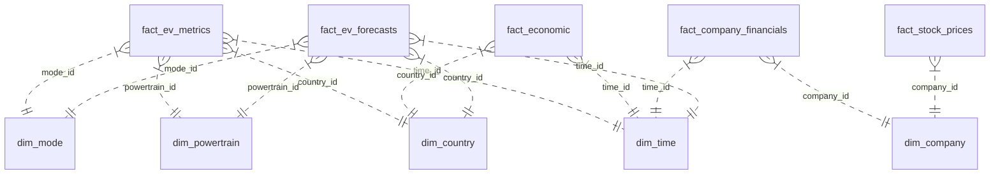

# ⚡ EV Market Intelligence & Predictive Analytics Platform

An end-to-end global Electric Vehicle (EV) Data Warehouse, REST API service, and interactive Intelligence Dashboard. This platform integrates historical EV adoption metrics (IEA), macroeconomic indicators (World Bank), automotive OEM financials, stock price performance, and machine learning ensemble forecasts (2025–2030).

---

## 🚀 Key Features

- **Star Schema Data Warehouse**: SQLite-powered data warehouse (`ev_intelligence_dw.sqlite`) designed with star schema architecture featuring 6 dimension tables and 5 fact tables (>84,000 records).
- **Executive KPI Dashboard**: High-level metrics tracking global EV sales, EV stock, top 5 markets, CAGR projections (2024–2030), and country adoption trends.
- **Interactive Multi-dimensional Analytics**: Filter historical metrics by country/region, vehicle type (Cars, Vans, Buses, 2/3-Wheelers, Trucks), and powertrain technology (BEV, PHEV, FCEV).
- **Macroeconomic & Financial Intelligence**: Correlate EV adoption with GDP per capita, population growth, crude oil prices, electricity access, and OEM financials (Revenue, Net Income, Stock Prices).
- **Machine Learning Forecasts (2025–2030)**: Predictive model projections across multiple market scenarios (Base Case, Accelerated, Stagnant).
- **Decision Support & Market Expansion Evaluator**: Dynamic Multi-Criteria Decision Analysis (MCDA) calculating Market Attractiveness Index, risk ratings, and expansion recommendations.
- **What-If Scenario Simulator**: Real-time economic policy simulation (GDP fluctuations, oil price shocks, subsidy incentives).

---

## 🛠️ Architecture & Tech Stack

| Component | Technologies Used |
| :--- | :--- |
| **Data Warehouse** | SQLite 3, Star Schema Architecture (`04_SQL/schema.sql`) |
| **ETL & Data Processing** | Python, Pandas, NumPy (`03_Scripts/`) |
| **Backend REST API** | Python, Flask, Flask-CORS (`backend/app.py`) |
| **Frontend UI** | HTML5, CSS3, JavaScript / React, Chart.js / Recharts, Vite (`frontend/`) |

---

## 📁 Repository Structure

```text
EV_Intelligencee_platform/
├── 01_Raw_Data/             # Raw dataset sources (IEA, World Bank, Financials)
├── 02_Cleaned_Data/         # Processed & standardized CSV datasets
├── 03_Scripts/              # Data cleansing, ETL, and Data Warehouse loader scripts
├── 04_SQL/                  # Data Warehouse Star Schema DDL definitions
├── backend/                 # Flask REST API server (app.py)
├── frontend/                # Interactive SPA Dashboard (Vite project)
├── ev_intelligence_dw.sqlite# Embedded Data Warehouse SQLite database
└── .gitignore               # Ignored files (node_modules, cache, local outputs)
```

---

## 🚦 Quick Start Guide

### Prerequisites

- **Python**: `3.9+`
- **Node.js**: `v18+` & `npm`

---

### 1️⃣ Setup & Run Backend API

1. Navigate to the project root directory:
   ```bash
   cd backend
   ```

2. Install backend dependencies (if needed):
   ```bash
   pip install flask flask-cors numpy
   ```

3. Launch the Flask API server:
   ```bash
   python app.py
   ```
   *The backend server will run on `http://localhost:5005`.*

---

### 2️⃣ Setup & Run Frontend Dashboard

1. Open a new terminal window and navigate to `frontend`:
   ```bash
   cd frontend
   ```

2. Install Node dependencies:
   ```bash
   npm install
   ```

3. Start the Vite development server:
   ```bash
   npm run dev
   ```
   *Open the URL shown in terminal (e.g., `http://localhost:5173`) in your browser.*

---

## 📊 Database Star Schema Overview



---

## 📡 API Reference Endpoint Summary

| Method | Endpoint | Description |
| :--- | :--- | :--- |
| `GET` | `/api/kpis` | Returns executive global KPIs & platform stats |
| `GET` | `/api/historical/sales` | Filterable EV sales & stock history |
| `GET` | `/api/macroeconomic` | GDP, Population, Oil, Electricity data by country |
| `GET` | `/api/financials` | Income statements & stock prices by OEM company |
| `GET` | `/api/forecasts` | ML ensemble sales projections (2025–2030) |
| `POST` | `/api/decision-support/evaluate` | Dynamic Market Attractiveness Index computation |
| `POST` | `/api/scenario-simulator` | What-If demand shift simulation |
| `GET` | `/api/schema` | Live metadata and table record counts |

---

## 📄 License

This project is open-source under the [MIT License](LICENSE).
